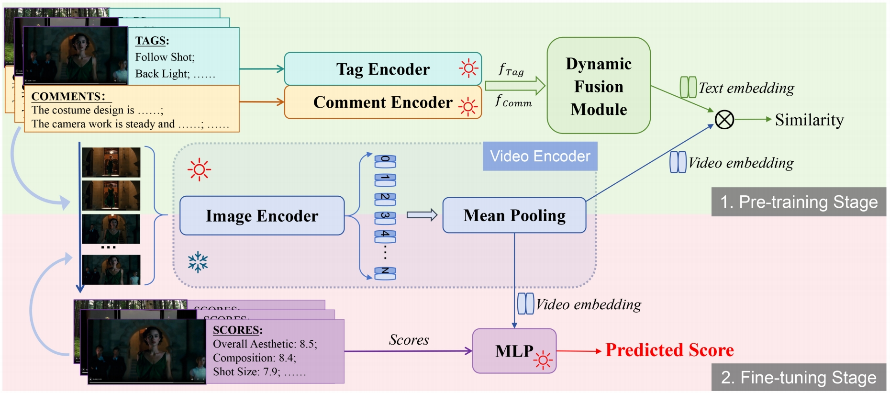
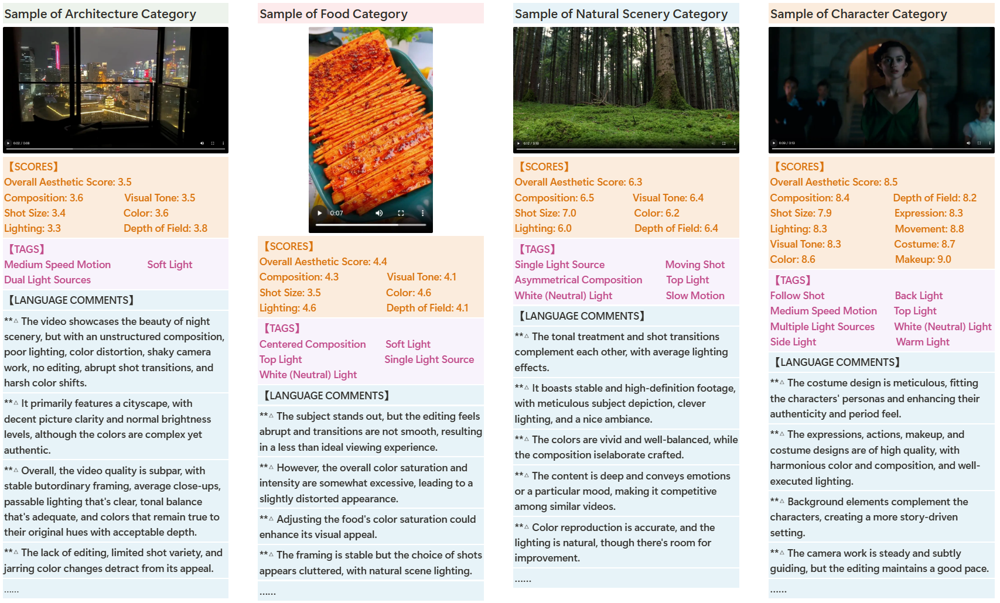

# VADB: Video Aesthetics Database and Scoring Framework

This repository introduces **VADB**, a large-scale video aesthetics database, and **VADB-Net**, a novel video aesthetics scoring framework designed to evaluate the aesthetic quality of videos across multiple dimensions. Our work provides comprehensive resources for researchers and developers interested in video aesthetics analysis, computer vision, and multimedia content assessment.

<div align="center">
  
  <br>
  <b>Figure 1: Architecture of the VADB-Net Video Encoder</b>
</div>


<div align="center">
  
  <br>
  <b>Figure 2: Sample videos and annotations from the VADB dataset</b>
</div>

## 📦 Dataset
The **VADB dataset** is publicly available on Hugging Face:  
[https://huggingface.co/datasets/BestiVictoryLab/VADB](https://huggingface.co/datasets/BestiVictoryLab/VADB)

**The VADB dataset is licensed under CC BY-NC 4.0**, which prohibits any commercial use. For commercial collaborations, please contact us.

It includes:
- **9,000+ videos** covering diverse video styles and content categories
- **Detailed language comments** for each video
- **Aesthetic scores across 7-11 dimensions**, comprehensively covering the aesthetic attribute features of videos
- **Rich objective tags**, annotating video shooting techniques and other objective dimensions

## 🧠 Models & Code

### Video Encoder
The pre-trained **video encoder model** can be obtained from Google Drive:  
[https://huggingface.co/BestiVictoryLab/vadb-video-encoder](https://huggingface.co/BestiVictoryLab/vadb-video-encoder)  
This encoder extracts aesthetic feature vectors from videos and serves as the foundational component for all scoring models.

### Scoring Models
The repository is structured into three main components:

#### 1. Overall Aesthetic Score
- **Folder**: `1TotalScore`
- **Model**: Predicts the overall aesthetic score of videos
- **Usage**:
  ```bash
  cd 1TotalScore
  python 1TotalScore.py
  ```

#### 2. General Attribute Scores
- **Folder**: `2GeneralAttribute`
- **Model**: Evaluates general aesthetic attributes of videos
- **Evaluation Dimensions**:
  - Composition
  - Shot Size
  - Lighting
  - Visual Tone
  - Color
  - Depth of Field
- **Usage**:
  ```bash
  cd 2GeneralAttribute
  python 2GeneralAttribute.py
  ```

#### 3. Human-Centric Attribute Scores
- **Folder**: `3HumanAttribute`
- **Model**: Focuses on evaluating specific aesthetic attributes of human subjects
- **Evaluation Dimensions**:
  - Expression
  - Movement
  - Costume
  - Makeup
- **Usage**:
  ```bash
  cd 3HumanAttribute
  python 3HumanAttribute.py
  ```

## 🚀 Getting Started
1. Install the required dependencies (see `requirements.txt`).
2. Download the VADB dataset from Hugging Face.
3. Load the pre-trained video encoder.
4. Run the scoring model suitable for your use case.

## 📜 License
- **VADB dataset**: Licensed under [CC BY-NC 4.0](https://creativecommons.org/licenses/by-nc/4.0/) (commercial use prohibited).
- **Code and models**: Licensed under [CC BY 4.0 License](LICENSE).
    
